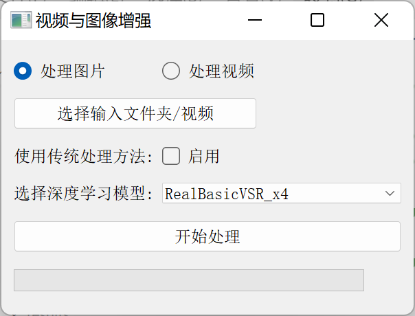

目录

[TOC]

# RealBasicVSR

## 代码使用

### 库地址：

Github地址： [RealBasicVSR地址](https://github.com/ckkelvinchan/RealBasicVSR)

### 配置环境

1.推荐创建虚拟环境，python版本使用1.8

2.安装pytorch 和 torchvision

查找适配版本： [official instructions](https://pytorch.org/get-started/locally/)

作者版本：

```python
conda install pytorch==1.7.1 torchvision==0.8.2 torchaudio==0.7.2 cudatoolkit=10.1 -c pytorch
```

无cuda，cpu版本：

```python
conda install pytorch==1.7.1 torchvision==0.8.2 torchaudio==0.7.2 cpuonly -c pytorch
```

3.安装mim and mmcv-full

```
pip install openmim
mim install mmcv-full
```

4.安装mmedit

```
pip install mmedit
```

5.下载预训练模型

[Dropbox](https://www.dropbox.com/s/eufigxmmkv5woop/RealBasicVSR.pth?dl=0) / [Google Drive](https://drive.google.com/file/d/1OYR1J2GXE90Zu2gVU5xc0t0P_UmKH7ID/view) / [OneDrive](https://entuedu-my.sharepoint.com/:u:/g/personal/chan0899_e_ntu_edu_sg/EfMvf8H6Y45JiY0xsK4Wy-EB0kiGmuUbqKf0qsdoFU3Y-A?e=9p8ITR)

下载至路径：`checkpoints/`


### 使用说明：

运行以下命令：

```
python inference_realbasicvsr.py ${CONFIG_FILE} ${CHECKPOINT_FILE} ${INPUT_DIR} ${OUTPUT_DIR} --max-seq-len=${MAX_SEQ_LEN} --is_save_as_png=${IS_SAVE_AS_PNG}  --fps=${FPS}
```

这段脚本支持图像和视频作为输入和输出。你可以简单地将 `${INPUT_DIR}` 和 `${OUTPUT_DIR}` 更改为对应视频文件的路径，如果你想使用视频作为输入和输出。但需要注意的是，保存为视频可能会导致额外的压缩，从而降低输出质量。


使用模型自带数据：

#### 1.图像文件夹作为输入和输出

```
python inference_realbasicvsr.py configs/realbasicvsr_x4.py checkpoints/RealBasicVSR_x4.pth data/demo_000 results/demo_000
```


##### **压缩图片为对比视频样例**

使用`generate_video_demo.py`程序可以将输出的图片压缩为前后对比视频

运行图片压缩成视频的程序`generate_video_demo.py`时报错：

```python
Traceback (most recent call last):
  File "d:\Python\projects\spzq\RealBasicVSR\generate_video_demo.py", line 128, in <module>
    video_demo()
  File "d:\Python\projects\spzq\RealBasicVSR\generate_video_demo.py", line 69, in __call__
    img_out = self.merge_images(img_left, img_right, current_idx)
  File "d:\Python\projects\spzq\RealBasicVSR\generate_video_demo.py", line 49, in merge_images
    img_out[:, x_coord:, :] = img_right[:, x_coord:, :]
ValueError: could not broadcast input array from shape (360,640,3) into shape (1440,2560,3)
```

**报错原因**：前后图片尺寸不同

**解决方法：**

把65、66行的代码的注释取消掉：

```python
img_right = mmcv.imrescale(
                    img_right, 4, interpolation='nearest', backend='cv2')
```

##### 代码解析

###### 类构造函数 `__init__`

**输入参数**：

- `input_left_dir`：左侧图像的目录路径。
- `input_right_dir`：右侧图像的目录路径。
- `output_path`：输出视频文件的路径。
- `start_frame`：从哪一帧开始滑动组合图像。
- `pause_frame`：在哪一帧暂停。
- `repeat_when_pause`：在暂停时重复的帧数。
- `slide_step`：滑动时每次移动的步长。
- `line_width`：分隔两张图像的线条宽度。
- `frame_rate`：输出视频的帧率。

###### 方法 `merge_images`

- **功能**：将左侧和右侧的图像合并，指定 `x_coord` 作为滑动的位置，并在合并的图像中添加一条白线作为分隔。
- 参数
  - `img_left`：左侧图像。
  - `img_right`：右侧图像。
  - `x_coord`：当前滑动的 x 坐标。
- **返回**：合并后的图像。

###### 3. 方法 `__call__`

​	**功能**：生成视频的主逻辑，包括图像加载、图像合并、视频写入、滑动处理和暂停处理。

###### 4. 主程序

​	创建一个 `VideoDemo` 实例，指定左侧和右侧的图像目录、输出视频路径、滑动参数、暂停帧等，然后调用这个实例以生成视频演示。

**使用说明：**

根据文件夹内图片的张数，更改`start_frame`， `pause_frame`， `repeat_when_pause`这三项

代码中的示例是按照文件夹中有**30张**即30帧照片设置的。


#### 2.视频作为输入和输出

```
python inference_realbasicvsr.py configs/realbasicvsr_x4.py checkpoints/RealBasicVSR_x4.pth data/demo_001.mp4 results/demo_001.mp4 --fps=12.5
```


### 个人修改：

#### 增加`split.py`:

```python
import cv2
import os

def split_video_to_frames(video_path, output_folder):
    cap = cv2.VideoCapture(video_path)
    
    if not cap.isOpened():
        print("无法打开视频文件")
        return
    
    frame_idx = 0
    while True:
        ret, frame = cap.read()
        if not ret:
            break
        frame_path = os.path.join(output_folder, f"frame_{frame_idx:04d}.png")
        cv2.imwrite(frame_path, frame)
        frame_idx += 1
    
    cap.release()
    print(f"视频已切割为 {frame_idx} 帧，并保存到文件夹: {output_folder}")

if __name__ == "__main__":
    video_path = "data/try.mp4"
    output_folder = "data/frames/"
    split_video_to_frames(video_path, output_folder)
```

**用途：**

将视频文件逐帧读取，并将每一帧保存为单独的图像文件，最后将视频帧导出到指定的文件夹。


#### 增加`merge.py`：

```python
import os
import cv2

def combine_frames_to_video(image_folder, output_video_path, fps):
    images = sorted([img for img in os.listdir(image_folder) if img.endswith(".png")])
    if not images:
        print("未找到任何图像")
        return

    first_frame = cv2.imread(os.path.join(image_folder, images[0]))
    height, width, layers = first_frame.shape
    fourcc = cv2.VideoWriter_fourcc(*'mp4v')
    out = cv2.VideoWriter(output_video_path, fourcc, fps, (width, height))

    for image in images:
        img_path = os.path.join(image_folder, image)
        frame = cv2.imread(img_path)
        out.write(frame)

    out.release()
    print(f"增强视频已保存为: {output_video_path}")

if __name__ == "__main__":
    # 将帧合并为视频
    image_folder = "results/dl/frames/"
    output_video_path = "results/try_enhanced_video.mp4"
    fps = 25
    combine_frames_to_video(image_folder, output_video_path, fps)
```

**用途：**

将帧合并成视频。


#### **增加`contrast.py`：**

```python
import sys
import os
import cv2
import numpy as np
import subprocess
from PyQt5.QtWidgets import (
    QApplication, QMainWindow, QPushButton, QFileDialog, QVBoxLayout, QWidget, QLabel, QProgressBar, QCheckBox, QComboBox, QGridLayout, QRadioButton, QButtonGroup
)
from PyQt5.QtCore import Qt, QThread, pyqtSignal

# Define paths for saving results
RESULTS_DIR = 'results'
TRADITIONAL_DIR = os.path.join(RESULTS_DIR, 'traditional')
DL_DIR = os.path.join(RESULTS_DIR, 'dl')

# Ensure result directories exist
os.makedirs(TRADITIONAL_DIR, exist_ok=True)
os.makedirs(DL_DIR, exist_ok=True)

class Worker(QThread):
    progress = pyqtSignal(int)
    finished = pyqtSignal()

    def __init__(self, input_path, is_video, traditional_methods, dl_model, parent=None):
        super().__init__(parent)
        self.input_path = input_path
        self.is_video = is_video
        self.traditional_methods = traditional_methods
        self.dl_model = dl_model

    def run(self):
        if self.traditional_methods:
            if self.is_video:
                self.process_video_traditional()
            else:
                self.process_images_traditional()
        if self.is_video:
            self.process_video_dl()
        else:
            self.process_images_dl()
        self.finished.emit()

    def process_images_traditional(self):
        files = [f for f in os.listdir(self.input_path) if f.endswith(('.png', '.jpg', '.jpeg'))]
        total_files = len(files)
        for i, file_name in enumerate(files):
            image_path = os.path.join(self.input_path, file_name)
            image = cv2.imread(image_path)
            image = enhance_traditional(image)
            output_path = os.path.join(TRADITIONAL_DIR, file_name)
            cv2.imwrite(output_path, image)
            self.progress.emit(int(100 * (i + 1) / total_files))

    def process_video_traditional(self):
        cap = cv2.VideoCapture(self.input_path)
        
        # 获取输入视频的帧率和分辨率
        fps = cap.get(cv2.CAP_PROP_FPS)
        frame_width = int(cap.get(cv2.CAP_PROP_FRAME_WIDTH))
        frame_height = int(cap.get(cv2.CAP_PROP_FRAME_HEIGHT))
        
        # 提取输入视频的文件名，并保留扩展名
        input_filename = os.path.basename(self.input_path)
        output_path = os.path.join(TRADITIONAL_DIR, input_filename)
        
        # 使用与输入视频匹配的编码器和参数创建VideoWriter
        fourcc = cv2.VideoWriter_fourcc(*'mp4v')
        out = cv2.VideoWriter(output_path, fourcc, fps, (frame_width, frame_height))
        
        total_frames = int(cap.get(cv2.CAP_PROP_FRAME_COUNT))
        frame_idx = 0
        
        while cap.isOpened():
            ret, frame = cap.read()
            if not ret:
                break
            frame = enhance_traditional(frame)
            out.write(frame)
            frame_idx += 1
            self.progress.emit(int(100 * frame_idx / total_frames))
        
        cap.release()
        out.release()


    def process_images_dl(self):
        command = [
            'python', 'inference_realbasicvsr.py',
            'configs/realbasicvsr_x4.py',
            f'checkpoints/{self.dl_model}.pth',
            self.input_path,
            DL_DIR
        ]
        subprocess.run(command)
        
    def process_video_dl(self):
         # 提取输入视频的文件名，并保留扩展名
        input_filename = os.path.basename(self.input_path)
        command = [
            'python', 'inference_realbasicvsr.py',
            'configs/realbasicvsr_x4.py',
            f'checkpoints/{self.dl_model}.pth',
            self.input_path,
            os.path.join(DL_DIR, input_filename),
            '--fps', '25',
            '--max_seq_len', '2'
        ]
        subprocess.run(command)

def enhance_traditional(image):
    image = sharpen_image(image)
    image = filter_image(image)
    image = interpolate_image(image)
    return image

def sharpen_image(image):
    kernel = np.array([[0, -1, 0],
                       [-1, 5, -1],
                       [0, -1, 0]])
    return cv2.filter2D(image, -1, kernel)

def filter_image(image):
    # Apply a basic filter, e.g., Gaussian blur
    return cv2.GaussianBlur(image, (5, 5), 0)

def interpolate_image(image, scale_factor=4):
    height, width = image.shape[:2]
    new_dim = (int(width * scale_factor), int(height * scale_factor))
    return cv2.resize(image, new_dim, interpolation=cv2.INTER_CUBIC)

class MainWindow(QMainWindow):
    def __init__(self):
        super().__init__()
        self.setWindowTitle('视频与图像增强')
        self.setGeometry(100, 100, 600, 400)
        
        self.input_path = ""
        self.is_video = False
        self.traditional_methods = []
        self.dl_model = 'RealBasicVSR_x4'
        
        layout = QGridLayout()

        self.radio_group = QButtonGroup(self)
        
        self.image_radio = QRadioButton("处理图片")
        self.image_radio.setChecked(True)
        self.image_radio.toggled.connect(self.set_input_type)
        self.radio_group.addButton(self.image_radio)
        layout.addWidget(self.image_radio, 0, 0)
        
        self.video_radio = QRadioButton("处理视频")
        self.video_radio.toggled.connect(self.set_input_type)
        self.radio_group.addButton(self.video_radio)
        layout.addWidget(self.video_radio, 0, 1)
        
        self.select_input_btn = QPushButton("选择输入文件夹/视频")
        self.select_input_btn.clicked.connect(self.select_input)
        layout.addWidget(self.select_input_btn, 1, 0, 1, 2)
        
        self.method_label = QLabel("使用传统处理方法:")
        layout.addWidget(self.method_label, 2, 0)
        
        self.traditional_cb = QCheckBox("启用")
        layout.addWidget(self.traditional_cb, 2, 1)
        
        self.dl_model_label = QLabel("选择深度学习模型:")
        layout.addWidget(self.dl_model_label, 3, 0)
        
        self.dl_model_combo = QComboBox()
        self.dl_model_combo.addItems(['RealBasicVSR_x4'])
        layout.addWidget(self.dl_model_combo, 3, 1, 1, 3)
        
        self.process_btn = QPushButton("开始处理")
        self.process_btn.clicked.connect(self.start_processing)
        layout.addWidget(self.process_btn, 4, 0, 1, 4)
        
        self.progress_bar = QProgressBar()
        layout.addWidget(self.progress_bar, 5, 0, 1, 4)
        
        container = QWidget()
        container.setLayout(layout)
        self.setCentralWidget(container)

    def set_input_type(self):
        self.is_video = self.video_radio.isChecked()

    def select_input(self):
        options = QFileDialog.Options()
        if self.is_video:
            self.input_path, _ = QFileDialog.getOpenFileName(self, "选择视频文件", "", "视频文件 (*.mp4);;所有文件 (*)", options=options)
        else:
            self.input_path = QFileDialog.getExistingDirectory(self, "选择输入文件夹", options=options)
        print(f"选择的输入路径: {self.input_path}")

    def start_processing(self):
        if not self.input_path:
            print("请输入路径")
            return
        
        self.traditional_methods = ['enhance_traditional'] if self.traditional_cb.isChecked() else []
        self.dl_model = self.dl_model_combo.currentText()
        
        self.worker = Worker(self.input_path, self.is_video, self.traditional_methods, self.dl_model)
        self.worker.progress.connect(self.update_progress)
        self.worker.finished.connect(self.processing_finished)
        self.worker.start()
    
    def update_progress(self, value):
        self.progress_bar.setValue(value)
    
    def processing_finished(self):
        self.progress_bar.setValue(100)
        print("处理完成!")

if __name__ == "__main__":
    app = QApplication(sys.argv)
    window = MainWindow()
    window.show()
    sys.exit(app.exec_())
```

**用途：**

实现了一个简单的PyQt5应用程序，可以选择使用传统图像处理方法（如锐化、过滤、插值）或深度学习模型（RealBasicVSR_x4）来增强图像或视频。应用程序支持选择输入文件夹或视频文件，显示处理进度，并将结果保存到不同的目录中。

传统图像处理方法：对每帧图片依次进行锐化、滤波和插值操作。

深度学习方法：使用预训练好的RealBasicVSR模型进行操作

**界面展示：**




个人总结：

**RealBasicVSR处理图片比处理视频效果要略好一点，推荐先将输入视频分割逐帧分割成图片文件夹，再使用深度超分模型进行处理，最后合成视频。**


## 论文解读

论文链接：[[paper](https://arxiv.org/pdf/2111.12704.pdf)]

推荐博客：

[**不容错过！作者亲自解读 CVPR 2022 RealBasicVSR - OpenMMLab的文章 - 知乎**](https://zhuanlan.zhihu.com/p/482656858) **论文设计解读**

[**手把手带你训练 CVPR2022 视频超分模型 - 知乎 (zhihu.com)**](https://zhuanlan.zhihu.com/p/500687519) **模型训练使用**

[超分概念集锦-CSDN博客](https://blog.csdn.net/NCU_wander/article/details/98357550) 

### 概念解释：

- **下采样**‌**（‌Subsampling）‌**：也称为降采样或缩小图像，‌其主要目的是使图像符合显示区域的大小或生成对应图像的缩略图。‌下采样通过将原始图像的尺寸减小，‌以达到减少数据量和便于处理的目的。‌

- **超分**‌**（‌Super-resolution）‌**：‌则是一个相反的过程，‌旨在从低分辨率的图像或信号中恢复出高分辨率的图像或信号。‌

- **超分辨率（Super Resolution，SR）**

  与超分相对应的是低分辨率图像（Low Resolution,LR），以及经常作为Ground Truth的高分辨率图像（High Resolution, HR）。

  **超分辨率是一项底层图像处理任务，将低分辨率的图像映射至高分辨率，以期达到增强图像细节的作用。**

  图像模糊不清的原因有很多，比如各式噪声、有损压缩、降采样……超分辨率是计算机视觉的一个经典应用。SR是指通过软件或硬件的方法，从观测到的低分辨率图像重建出相应的高分辨率图像（就是提高分辨率），在监控设备、卫星图像遥感、数字高清、显微成像、视频编码通信、视频复原和医学影像等领域都有重要的应用价值。

- **超分分类**
  一般来说，超分分为以下两种应用场景：
  **SISR**： 只参考当前低分辨率图像，不依赖其他相关图像的超分辨率技术，称之为单幅图像的超分辨率（Single Image Super Resolution，SISR），需要注意的是对于一个低分辨率图像，可能存在许多不同的高分辨率图像与之相对应。
  **VSR**： 参考多幅图像或多个视频帧的超分辨率技术，称之为多帧视频/多图的超分辨率（multi-frame super resolution/Video SR）。对于video SR，其核心思想就是用时间带宽换取空间分辨率。既可以通过多张图像来获得图像更多的信息，又可以综合考虑图像的前后帧语义，使得连续图像之间的信息表达有连续性。**VSR目前主流的做法是通过多帧之间的帧间对齐（光流计算+运动补偿）；多帧融合（超分重建）来得到最终的超分结果。**

  我们通常理解的超分辨率都是指SISR，我们只需要输入一张低分辨率图像而获得高分辨率图像的输出。 而VSR会利用视频的时间关联性来获得对某一帧的SR。

- **视频超分**

​	视频超分，假设低分辨率视频是从高分辨率的视频经过一系列的退化操作而得到，**超分算法就是将该退化操作进行求逆，从而可以	将低分辨率视频恢复成高分辨率视频**。该退化操作可以表达为：


​	式中符号分别表示低分辨率视频的第i帧，高分辨率视频的第i帧，以i帧为中心的2N+1个高分辨率视频帧，及退化操作。

​	**通常退化操作为下采样，模糊，以及运动形变等**。现实情况中，退化可能更加复杂，如颜色空间转换、压缩等。

​	**超分算法的目标即求解该退化过程的逆操作**：


- **评价指标**
  常用的图像质量评估指标有如下三种：

  - **MSE**：Mean Squared Error，逐个比较两幅图像的像素差，最终求解所有像素的均方误差
  - **PSNR**：：Peak Signal to Noise Ratio，峰值信噪比，即峰值信号的能量与噪声的平均能量之比，数值越大表示失真越小，通常表示的时候取 log 变成分贝（dB），由于 MSE 为真实图像与含噪图像之差的能量均值，而两者的差即为噪声，因此 PSNR 即峰值信号能量与 MSE 之比。
  - **SSIM**：Structural Similarity， 由于基于像素的简单计算不符合人类视觉系统（Human Visual System，HVS）的评价结果，因此需要对评价方式进行重新考量。SIMM的评价指标在如下三点：1. luminance，亮度；2. contrast，对比度；3. structure，结构。SSIM取值范围[0,1]，值越大，表示图像失真越小。

- **图像增强**

  - **上采样（UnSampling）**：相比于数据集的上采样与下采样，图像也有属于自己的上采样与下采样，对应着常见的用语：增强与压缩。在深度学习中图像的上采样包括反卷积(Deconvolution)、传统插值与上池化(UnPooling)。
  - **反卷积**： https://buptldy.github.io/2016/10/29/2016-10-29-deconv/ 卷积的本质就是矩阵运算，这篇博客通过对矩阵运算的讲解，将卷积与反卷积的数学本质解释的很透彻。
  - **上池化**： 也就是反池化
  - **传统插值**：包括双线性插值、三次样条插值，都属于传统的图像插值方法。注意：图像上采样几乎都是采用内插值方法，即在原有图像像素的基础上在像素点之间采用合适的插值算法插入新的元素；而下采样是直接向下进行s倍的下采样。无论图像下采样还是图像上采样，采样方式有很多种。如最近邻插值，双线性插值，均值插值，中值插值等方法。插值只是上下采样的手段，务必了解这一点

- **非盲超分 (non-blind super-resolution)：**超分辨率的子领域。在这个任务中假设下采样的方式已知（例如 bicubic 下采样），因此可以人工生成无限训练数据。

- **真实视频超分 (real-world video super-resolution)：**指在对于真实视频的超分，难点在于真实视频的退化是未知且多样化的，因此很难采集适当的数据进行训练。

- **长期传播 (long-term propagation)：**指 Recurrent Network 中的传播方式。该方法把当前帧的信息传到下一帧, 从而把长期信息累积起来。代表方法有 BasicVSR，IconVSR，和 BasicVSR++。

  

> （以下内容摘自[不容错过！作者亲自解读 CVPR 2022 RealBasicVSR - OpenMMLab的文章 - 知乎](https://zhuanlan.zhihu.com/p/482656858) ）

### 创新设计：

尽管长期传播在非盲设定下取得成功，真实视频超分辨率退化的多样性和复杂性在推理和训练中还是引起了不小的挑战。
**首先**，虽然长期传播会在轻度退化的情况下提高性能，但严重的退化可能会通过传播被放大，从而损害输出视频的质量。为了平衡细节合成和退化抑制之间的权衡，我们发现图像预清理阶段对于在传播之前减少噪声和退化是必不可少的。配备精心设计的**预清理模块**，我们的 RealBasicVSR 在质量和效率上都优于现有方法。
**其次**，为提高模型的通用性，现实世界的视频超分模型通常利用各种退化训练，这就需要较大的 batch size 以产生稳定的梯度。增大 batch size 意味增加了计算负担，这也不得不让我们做出一些权衡取舍，包括（1）**速度和性能之间的权衡**，以及（2）**batch size 与时序序列长度之间的权衡。**
针对第一个问题，我们提出了一种**随机退化方案**，可以在不牺牲性能的情况下减少多达 40% 的训练时间。针对第二个问题，我们分析不同的训练设置，发现**在训练期间使用更长的序列而不是更大的 batch size ，可以更有效地使用时间信息**，从而在推理过程中实现更稳定的性能。
**最后**，为了促进公平比较，我们提出了新的 **VideoLQ 数据集**，其中包含大量真实世界的低质量视频，其中涵盖了丰富的纹理和模式。

### 问题 1 - 长期传播放大退化，影响输出质量


如上图左所示，在非盲设定下，当序列长度 L 增加时，BasicVSR 能够通过长期传播聚合有用信息，生成更多细节输出。相比之下，对于真实视频，虽然传播有助于在轻度退化的情况下增强细节，但是更长的序列传播可能会放大噪声和退化。我们可以看到，当仅使用一帧恢复序列时，BasicVSR 能够去除输入中的噪声并产生平滑的输出，但使用整个序列时，输出反倒产生了严重的退化。

虽然使用长期信息有助于合成精细的细节，但它也可能放大退化。显然，在**增强细节**和**抑制退化**之间存在权衡。

#### 预清理模块

为解决上述问题，我们提出一个简单的*预清理*模块，在传播之前抑制退化。大体思路是“清理”输入序列，以减低输入中的退化对后续超分网络的影响。


采用了 BasicVSR 作为超分网络，因为它通过长期传播在非盲超分辨率中具有良好的性能，并且结构简单。从上图可以看到：在 BasicVSR 之前加上预清理模块，输入图像首先独立地传递给预清理模块以去除退化。

####  动态优化 (Dynamic Refinement)

在许多具有挑战性的情况下，将图像单次输入到预清理模块并不能有效地消除过度退化。一种简单而有效的方法是将图像多次输入预清理，以进一步抑制退化。下图中我们展示了一个使用 dynamic refinement 的示例。可以看到，当仅使用一次预清理模块时，图像可以显示更多细节，但无法完全消除噪音。另一方面，当使用预清理模块五次时，输出变得不自然且细节消失。相比之下，通过我们的动态优化方案，清洁阶段会自动停止以避免过度平滑。我们看到输出包含更少的退化，同时保留了必要的细节。我们观察到在大多数情况下最多需要 3 次迭代。


### 问题 2 - 训练速度与性能的权衡

当使用 **N** 个 GPU 训练、 batch size 为 **B** 、序列长度为 **L** 时，CPU 需要在每次迭代中加载 **N x B x L** 个图像。在真实视频超分中，我们需要更多的图像提供稳定梯度，这就引入了严重的 I/O 瓶颈，大大减慢了训练速度。为降低 I/O 瓶颈，我们可以减小 batch size 或序列长度，但这会导致模型性能下降。
在这项工作中，我们提出了一种随机退化方案，它在不牺牲性能的情况下显着提高了训练速度。下图显示 **L** = 4 的说明。


在我们的随机退化方案中，我们不是在每次迭代中加载 L 帧，而是加载 L / 2 帧，并在时间上翻转序列。这种设计允许我们用相同长度的序列进行训练，同时将 CPU 的负荷减少一半。然而，在这样的设置中，网络能感知的内容变少，并且网络有机会利用序列在时间上翻转的捷径。为了提高数据的多样性，我们将每一帧的退化建模为一个随机游走（Random Walk）。具体来说，设 **p_i** 是与应用于第 **i** 帧的退化相对应的参数。

如下图所示，与传统的训练方案相比，直接翻转序列会导致性能相似或质量下降。 例如，线图案的方向由于输入中的混叠效应而失真。 当使用随机退化时，网络对退化的变化更加鲁棒，从而提高了性能。 此外，如下表所示，通过减少处理的图像数量，CPU 的负荷显著减少。 结果，I/O 瓶颈得到改善，训练时间减少多达 40% 而不牺牲性能。（不同的硬件可能导致不同级别的瓶颈，和不同级别的加速。）


### 问题 3 - batch size 与序列长度的权衡


在显存资源固定的情况下，训练真实视频超分模型时增加的 batch size 不可避免地导致序列长度的减少。一方面，更大 batch size 的训练使网络能够在每次迭代中感知更多的退化和场景内容，从而产生更稳定的梯度。另一方面，使用更长的序列进行训练可以让网络更有效地使用长期信息。但是，当计算资源有限时，必须在更大的 batch size 或更长的序列之间选择。在本节中，我们使用 **B x L = 480** 的约束来训练 RealBasicVSR，并讨论这些模型的性能。


如上图所示，当使用 **B** = 48 ，**L** = 10 进行训练时，输出出现严重的颜色退化和扭曲的细节。当我们增加序列长度时，这种不良效果会减少。特别是，当 **L** 从 10 增加到 20 时，颜色退化显着减少，并且在 **L** 增加到 30 时进一步消除。

上面的比较表明，用更长的序列进行训练是可取的。我们推测，由于训练和推理之间的 domain gap，用短序列训练的网络在推理过程中不能适应长序列。为了进一步证明长序列在训练中的重要性，我们将 **B** 固定为 16，并将 **L** 从 30 减少到 10。可以观察到，当 **L** 减少时，相应的区域显示出相同的颜色退化和模糊。与 **B** = 48，**L** = 10 的情况相比，我们发现此类退化没有那么严重。因此，我们建议在施加计算约束时采用更长的序列。

### VideoLQ 数据集

为了评估真实视频超分方法的泛化性，一个涵盖广泛的**退化**、**內容**和**分辨率**的基准是必不可少的。大多数现有数据集只关注 bicubic 下采样等合成退化，因此它们不能反映真实视频超分方法的功效。在这项工作中，我们提出了 **VideoLQ** 数据集。

我们的 VideoLQ 数据集中的视频是从各种视频网站（如 Flickr 和 YouTube）下载的，具有 Creative Commons 许可证。为了确保视频的多样性，我们选择具有不同分辨率和内容的视频，以覆盖尽可能多的退化。对于每个视频，我们提取 100 帧的序列，不允许场景转换，以便评估依赖于长期传播的方法。选择序列以包含足够的纹理或文本以便于比较。此外，还包括 Vid4 中的 Ground-truth 视频。


# 传统图像处理技术

### 图像锐化（Image Sharpening）

图像锐化的目的是增强图像中物体的边缘和细节，使得图像看起来更清晰。常用的锐化方法包括：

- **拉普拉斯锐化（Laplacian Sharpening）**：通过计算图像的拉普拉斯算子，突出图像的边缘，然后将这些边缘信息加回原图像中。
- **非锐化掩模（Unsharp Masking）**：通过对图像进行高斯模糊，生成一个平滑版本，然后将模糊图像从原始图像中减去，从而增强边缘。

### 滤波（Filtering）

滤波用于去除图像中的噪声或者增强特定的特征（例如边缘）。滤波器可以是线性的或非线性的。常用的滤波方法包括：

- **均值滤波（Mean Filtering）**：一种简单的平滑技术，通过计算局部邻域内像素的平均值来去除噪声。
- **高斯滤波（Gaussian Filtering）**：使用高斯分布函数进行平滑，较为常用的平滑技术，能够有效减少高频噪声。
- **中值滤波（Median Filtering）**：一种非线性滤波器，通过用邻域内像素的中值替代中心像素值，特别适用于去除椒盐噪声。

### 插值法（Interpolation）

插值法用于在图像放大或缩小过程中生成新的像素值，以尽量减少失真。常见的插值方法包括：

- **最近邻插值（Nearest Neighbor Interpolation）**：使用最近邻的像素值来填充新位置，计算简单但可能导致锯齿效应。
- **双线性插值（Bilinear Interpolation）**：通过考虑相邻像素的线性加权平均来计算新像素值，能较好地平滑图像。
- **双三次插值（Bicubic Interpolation）**：考虑更大邻域内的16个像素，生成的图像比双线性插值更为平滑，质量更高，但计算量也更大。

### 其他常用技术

- **直方图均衡化（Histogram Equalization）**：通过调整图像直方图的分布，增强图像的对比度，尤其适用于低对比度图像的处理。
- **边缘检测（Edge Detection）**：通过Sobel、Canny等算子检测图像中的边缘，常作为其他处理操作的基础。